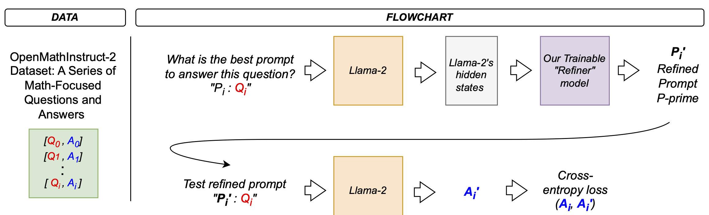

# Overcoming Constraints and Designing a Prompt Refinement Pipeline for LLMs

_Ben Maltbie_, _Junru Ren_, _Sloane Sambuco_

Large language models (LLMs) have revolutionized natural language processing (NLP), enabling high-quality performance on diverse tasks with minimal supervision. Among these advancements, zero-shot prompting has emerged as a powerful approach, allowing LLMs to perform tasks without explicit task-specific training. However, the effectiveness of zero-shot prompting depends heavily on the quality and specificity of the prompt itself. Poorly designed or generic prompts can lead to suboptimal model responses, especially in complex problem-solving scenarios. This project addresses the challenge of refining prompts to enhance the accuracy of responses generated by off-the-shelf LLMs in a zero-shot setting.

In this project, we have learned significantly as we trek through constraints and surprises. In that, we will present our results last, following what we've learned in the follow paragraphs.

---

## Motivation

The core motivation stems from the observation that LLMs possess vast potential, but their output can be significantly improved by tailoring the input prompt. By refining prompts dynamically based on specific tasks, we aim to harness this potential more effectively. Our approach leverages a dataset of (Question, Answer) pairs and a novel framework involving a trainable "Refiner" MLP model. The Refiner learns to produce optimized prompts that guide the LLM toward generating answers that better align with ground-truth responses.
This project has practical implications for domains where generating accurate, context-aware answers is crucial, such as customer support, educational tools, and knowledge retrieval systems. By training the Refiner to iteratively improve prompts, we strive to unlock more precise and reliable outputs from LLMs, thereby bridging the gap between zero-shot prompting's theoretical promise and its real-world applicability.

---

## Literature Review

By leveraging large-scale pre-trained models and carefully designed prompts, zero-shot prompting allows models to generalize their knowledge to unseen tasks, reducing the reliance on extensive labeled datasets. This literature review explores the evolution of zero-shot prompting, highlights key methodologies, and discusses significant contributions in the field.

### Foundations of Zero-Shot Prompting
The concept of zero-shot learning in NLP originated from the desire to classify data into categories not seen during training. Palatucci et al. (2009) introduced zero-shot learning in the context of predicting semantic concepts without direct examples. The rise of large pre-trained language models, particularly GPT-3 by Brown et al. (2020), revolutionized this idea by showcasing that models could perform a variety of tasks solely based on natural language prompts.

### Advancements in Prompt Engineering

* **Instruction Tuning**: Instruction tuning involves fine-tuning models on a diverse set of tasks described through natural language instructions. Wei et al. (2021) introduced FLAN (Finetuned Language Net), demonstrating that instruction tuning significantly enhances a model's ability to follow prompts in zero-shot settings. Similarly, Sanh et al. (2021) presented T0, a model trained on a multitude of tasks with prompt-based instructions, exhibiting strong generalization to unseen tasks.
* **Chain-of-Thought Prompting**: Chain-of-thought (CoT) prompting is a technique that improves reasoning capabilities by encouraging models to generate intermediate reasoning steps. Wei et al. (2022) showed that prompting models to "think step by step" enhances performance on complex tasks such as mathematical problem-solving and commonsense reasoning. For instance, appending prompts with "Let's think it through step by step" leads the model to provide detailed reasoning before arriving at an answer.
* **Zero-Shot-CoT**: Building upon CoT prompting, Kojima et al. (2022) introduced Zero-Shot-CoT, which enables models to perform reasoning tasks without any examples. By simply adding reasoning cues to prompts, models exhibit chain-of-thought reasoning in zero-shot scenarios. This approach significantly improved performance on tasks like numerical reasoning and logical deduction without requiring additional training data.

### Challenges and Limitations

* **Prompt Sensitivity**: Models exhibit high sensitivity to the wording and structure of prompts. Jiang et al. (2020) found that minor changes in phrasing can lead to significant variations in output quality, highlighting the need for meticulous prompt design.
* **Knowledge Cutoff**: Language models have a fixed knowledge cutoff based on their training data. Petroni et al. (2019) noted that models cannot access information beyond their training corpus, limiting their ability to provide up-to-date or specialized knowledge in zero-shot settings.
* **Bias and Fairness**: Zero-shot models may inadvertently reflect biases present in their training data. Bender et al. (2021) emphasized the ethical considerations of deploying large language models, cautioning against unintentional reinforcement of stereotypes and misinformation.

### Literature Review - Conclusion

Zero-shot prompting represents a significant advancement in NLP, enabling models to generalize across tasks without task-specific training data. While it offers substantial benefits in terms of flexibility and efficiency, challenges such as prompt sensitivity, knowledge limitations, and ethical considerations remain. Our project aims to contribute to this literature to experiment how zero-shot prompting can be improved, and further unlock the potential of zero-shot prompting, fostering the development of more adaptable and responsible AI systems.

---

## Data

The [OpenMathInstruct-2 dataset](https://huggingface.co/datasets/nvidia/OpenMathInstruct-2), developed by NVIDIA, is a comprehensive collection of problem-solution pairs aimed at enhancing mathematical reasoning in large language models (LLMs). This dataset is constructed using training problems from the GSM8K and MATH datasets.

Each entry in the dataset comprises the following fields:
* `problem`: The original or augmented mathematical problem.
* `generated_solution`: A synthetically generated solution to the problem.
* `expected_answer`: For original problems, this is the ground-truth answer from the dataset; for augmented problems, it is the majority-voting answer.
* `problem_source`: Indicates whether the problem is directly from GSM8K or MATH, or if it is an augmented version derived from these datasets.

---

## Methods

As noted above, we use the OpenMathInstruct-2 dataset, which consists of pairs of mathematical questions (Qi) and their corresponding answers (Ai). Each data point serves as a training instance for refining prompts. A base prompt P, referred to as the "problem-solving prompt," provides a generic instructional template for solving mathematical problems.

### Overview: The Training Pipeline

In our initial experiments, we set out to build a model that could learn to produce “refined prompts” to guide a Large Language Model (LLM) toward better answers. The intuition was as follows: given a question Q and a fixed "prompt-for-prompt" P, we would produce an intermediate, improved prompt that, when appended to the question, would help the LLM provide more accurate answers.

1. **Prepare Input**: We start with a known, fixed prefix prompt $P$ designed to elicit a refined prompt from the model, and we append the given question $Q$. Concretely, we form the string $P + Q$ and tokenize it.

2. **Run LLM to Get Hidden States**: We feed $P + Q$ into a frozen, off-the-shelf LLM. Importantly, we do not fine-tune this LLM. Instead, we only extract its internal hidden states from the last layer, effectively using it as a feature extractor. These hidden states encode rich semantic information about the question.

3. **Refiner Model** (more on this later): We introduce a trainable "Refiner" network that consumes the LLM’s hidden states and outputs logits over a vocabulary, ideally representing a “refined prompt” in token form. The conceptual goal is that the Refiner learns how to transform the LLM’s internal representation of the question into a better “prompt” that will guide the LLM toward a more accurate answer.

4. **Token Selection** (more on this later): Here we performed the critical step of converting the Refiner’s output logits into discrete tokens via an `argmax` operation. This step seemed natural—after all, we need a prompt made of tokens to feed back into the LLM. However, `argmax` is non-differentiable. This means that no meaningful gradient signal can propagate back through this decision, preventing the Refiner from learning how to produce better prompts. _After running extensive training experiments, we noticed that the training loss never improved. The prompt selection remained static, and the final LLM answer quality did not get better. By the time we identified the issue, a significant amount of time and computational resources had been invested._

5. **Concatenate Refined Prompt and Question**: After selecting tokens for the refined prompt, we would append the original question, forming something like: `refined_prompt + ": " + question`. This text would be given to the LLM to produce its answer.

6. **Teacher Forcing with Known Answer**: To measure how helpful the refined prompt was, we employed a teacher forcing strategy. We concatenated the known ground-truth answer A to the `final_input_text` and computed the language modeling loss of the LLM on predicting A given the prompt and question. Because the LLM was frozen, the idea was that if the refined prompt was well-crafted, it would make A more probable, lowering the cross-entropy loss. Counterintuitively to us initially, this practice does "leak" the answer into the input, but it’s intentional and doesn’t train the LLM. It’s only used to derive a gradient signal for the Refiner.

7. **Backpropagate into the Refiner**: The final step was supposed to update the Refiner’s parameters based on the LLM’s loss. But due to the non-differentiable token selection in Step 4, the gradients stopped dead at that boundary. No improvement occurred.

This pipeline, while conceptually neat, was fundamentally flawed at Step 4. The discrete token selection meant that no gradient-based learning could occur. We learned the hard way that if you rely on `argmax` to produce tokens, you break the differentiability chain that gradient-based optimization requires. Our attempt to salvage the experiment (after running it for a long time) taught us a crucial lesson in always double-checking the differentiability of your pipeline components.

### Working with LLM

At the outset of this project, one of our key goals was to work with an open-sourced Large Language Models (LLMs) that gives us access to its hidden states and is, hopefully, small enough for us to run in Google Colab, and the [`"meta-llama/Llama-2-7b-chat-hf"`](https://huggingface.co/meta-llama/Llama-2-7b-hf) model was a natural candidate. However, our initial attempt to load and run this model in a standard Google Colab environment presented immediate resource challenges. The Llama-2-7B model, even though smaller than its larger cousins (13B, 70B), still requires substantial GPU memory—far more than a default Colab instance typically provides.

#### Running Out of GPU RAM:
Simply loading the model in full precision (`float32`) on a Tesla T4 GPU (common in free Colab sessions) led to out-of-memory errors. Even on Colab Pro or Pro+ tiers, where one may get access to V100 or A100 GPUs with more VRAM, full-precision loading was pushing the limits. Without adjustments, the model initialization itself would fail due to insufficient GPU memory.

#### Leveraging 8-bit Quantization:
To overcome this, we turned to 8-bit quantization, a technique supported by libraries like [`bitsandbytes`](https://huggingface.co/docs/bitsandbytes/v0.43.2/index). Quantization effectively reduces the precision of model weights from `float32` or `float16` down to `int8`, compressing memory usage and allowing the model to be loaded on smaller GPUs. With 8-bit quantization, we managed to fit the Llama-2-7B model into Colab’s GPU memory budget. The trade-off is that quantization can slightly affect model quality or performance, but it makes the difference between being able to run experiments at all versus not.

#### Half Precision (FP16) and Mixed Precision:
Even with 8-bit quantization for weights, running inference and backpropagation can consume significant GPU memory. Thus, we opted to run certain computations in half precision (`float16`) for activations. Half precision reduces memory footprint and increases throughput, but it also introduces numerical stability concerns. To mitigate this, one can use mixed-precision training (via `torch.cuda.amp`) or gradient scaling, ensuring that smaller gradients are boosted numerically to avoid underflow.

#### Why We Needed This Setup:
The main objective was to construct a training setup where we continuously feed inputs into the LLM for hidden state extraction and/or gradient updates in a prompt-refinement loop. Doing so at full precision was simply not feasible within the constraints of Colab. Without 8-bit quantization for model weights and half precision for intermediate computations, we would have been stuck at the loading screen, unable to even begin our experiments.

The choice to use half precision and 8-bit quantization was not a luxury but a necessity. It enabled us to overcome the hardware limitations of a standard Colab environment, load `"meta-llama/Llama-2-7b-chat-hf"`, and proceed with our experiments into prompt refinement—experiments that later revealed more subtle challenges in differentiability and training stability.

### Refiner Model Design

The `Refiner` model we designed is a relatively straightforward neural network module built on top of the hidden states extracted from the frozen LLM. After receiving the LLM’s last-layer hidden states (a tensor of shape `[batch, seq_len, hidden_size]`), the `Refiner` first applies an adaptive average pooling operation across the temporal (sequence) dimension to condense the per-token representations into a single vector per example. This pooling step reduces the dimensionality from `[batch, seq_len, hidden_size]` to `[batch, hidden_size]`, effectively summarizing the entire question context into a fixed-size embedding. The pooled embedding is then passed through a small multi-layer perceptron (MLP) that transforms it into a set of logits corresponding to a sequence of seq_len tokens, each chosen from a vocabulary of size vocab_size. By reshaping the final MLP output into `[batch, seq_len, vocab_size]`, we obtain token-level logits that represent the “refined prompt.” Although simple and compact, this model encapsulates the core idea: distill the LLM’s representation of the input question into a new sequence of tokens intended to guide the LLM toward more accurate answer generation.

Mathematically, the Reinfer model can be described as the following:

Let the LLM hidden states be denoted as $$\mathbf{H} \in \mathbb{R}^{B \times L \times D}$$, where:

* $B$ is the batch size,
* $L$ is the sequence length (number of tokens in the input),
* $D$ is the hidden dimension of the LLM.

#### Step 1: Pooling Over the Sequence

The first step involves applying an adaptive average pooling across the sequence dimension. We transpose $\mathbf{H}$ to align the dimensions so that the hidden dimension is contiguous for pooling:

$$\mathbf{H}^\top = \text{Transpose}(\mathbf{H}, (0, 2, 1)) \in \mathbb{R}^{B \times D \times L}$$

Now we apply average pooling across the last dimension (the sequence length $L$):

$$\mathbf{x} = \text{AvgPool}(\mathbf{H}^\top) = \frac{1}{L} \sum_{l=1}^{L} \mathbf{H}^\top_{:,:,l} \in \mathbb{R}^{B \times D}$$

This operation condenses all token representations into a single vector \mathbf{x} per batch element, capturing the overall context provided by the original LLM states.

#### Step 2:  Multi-Layer Perceptron (MLP)

The pooled vector $\mathbf{x}$ is passed through a two-layer MLP with a ReLU non-linearity. Let:
* $\mathbf{W}_1 \in \mathbb{R}^{D \times D}$ and $\mathbf{b}_1 \in \mathbb{R}^{D}$ be the parameters of the first linear layer.
* $\mathbf{W}_2 \in \mathbb{R}^{D \times (T \cdot V)}$ and $\mathbf{b}_2 \in \mathbb{R}^{T \cdot V}$ be the parameters of the second linear layer,

where:
* $T$ is the target sequence length for the refined prompt,
* $V$ is the vocabulary size.

First linear + ReLU:

$$\mathbf{z} = \text{ReLU}(\mathbf{x}\mathbf{W}_1 + \mathbf{b}_1) \in \mathbb{R}^{B \times D}$$

Second linear layer:
$$\mathbf{o} = \mathbf{z}\mathbf{W}_2 + \mathbf{b}_2 \in \mathbb{R}^{B \times (T \cdot V)}$$

#### Step 3: Reshaping Into a Token Distribution

Finally, we reshape o\mathbf{o} into a 3D tensor representing token logits:

$$\mathbf{O} = \text{Reshape}(\mathbf{o}, [B, T, V]) \in \mathbb{R}^{B \times T \times V}$$

Here, each slice $\mathbf{O}_{b,t,:}$ corresponds to a vector of logits over the vocabulary $V$ for the $t$-th token of the refined prompt in the $b$-th example.

### Core Issue: Non-Differentiability

Realizing the core issue, we explored multiple alternatives to overcome the non-differentiability. Each had its own challenges and pitfalls:

#### 1. Reinforcement Learning (REINFORCE)
The first proposed solution was to cast the problem as a reinforcement learning scenario. Instead of directly optimizing a differentiable loss, we would:
* Treat the Refiner as a policy that outputs a prompt distribution.
* Sample tokens from this distribution and use the LLM’s final answer quality (e.g., exact match with the known answer) as a reward signal.
* Apply the REINFORCE algorithm (a policy gradient method) to update the Refiner parameters based on the reward, without needing differentiability through the token selection.

Outcome:
* While conceptually sound, implementing REINFORCE introduced complexity:
The reward often ended up being zero if the exact answer did not match perfectly, leading to no learning signal.
* Attempts to compute semantic rewards (like using partial credit or scoring methods) complicated the code.
* Early trials resulted in unstable training, NaNs in gradients, and difficulties in maintaining stability.

#### 2. Gumbel-Softmax with BERTScore
Another attempt was to use the Gumbel-Softmax trick to obtain a differentiable approximation of sampling. Gumbel-Softmax creates a "soft" one-hot vector that smoothly approximates the discrete argmax, allowing gradients to flow. On top of that, we considered using a semantic metric like BERTScore as the reward, so partially correct answers could yield non-zero gradients from the start.

Challenges Faced:
* Implementing Gumbel-Softmax led to various numerical stability issues.
* We encountered CUDA device-side assert errors with `torch.multinomial` and had trouble ensuring stable probabilities.
* Integrating BERTScore as a reward introduced overhead and complexity in the training loop, and we occasionally got `NaN` losses.
* The complexity of maintaining half-precision (FP16) for performance reasons, combined with gradient scaling and careful handling of embeddings, became overwhelming.

#### 3. Differentiable Prompt Representations (Soft Prompts)
The most elegant conceptual solution we explored was to avoid discrete tokens altogether during training. Instead, we would:

* Have the Refiner produce continuous embeddings that serve as a "soft prompt."
* These learned embeddings would be prepended directly to the LLM’s input embeddings.
* Since no discrete tokenization is involved, the entire pipeline (Refiner → LLM) remains differentiable.
* Gradients can flow from the final loss, through the LLM, and into the Refiner’s parameters.

Issues and Considerations:
* While this approach is theoretically sound and widely used in recent research (prompt tuning methods), we faced practical integration hurdles.
* Dealing with input embedding lengths, ensuring label sequences align properly, and avoiding NaN losses in half-precision all required careful engineering.
* Time constraints prevented a full, stable implementation of this approach in our given project timeframe.

#### Other Minor Issues and Lessons Learned

Beyond the main differentiability problem, we ran into several secondary issues that highlighted the complexity of implementing a non-trivial training pipeline:

* **NaN losses after the first step**: Likely due to half-precision training without proper gradient scaling or due to extreme parameter updates.
* **Dimension mismatches between inputs and labels**: Adding soft prompts or changing the prompt length led to size mismatches. Careful padding and ignoring indices were needed.
* **Model configuration attributes differences**: For certain models like "meta-llama/Llama-2-7b-chat-hf", attributes like n_embd differ from other LLM configurations, requiring careful adaptation.

### Reflections and Key Takeaways

Although we were not ultimately successful in implementing a working training loop to improve the Refiner’s prompts via differentiable methods within the given timeframe, this journey was deeply instructive. We learned about the subtle pitfalls of using `argmax` in a supposed gradient-based pipeline, explored advanced techniques (REINFORCE, Gumbel-Softmax, Soft Prompts), and wrestled with real-world engineering challenges such as floating point instability and dimension mismatches.
These lessons will serve as valuable insights for any future attempts at refining LLM prompts or other non-differentiable stages in deep learning pipelines.

---

## Experiments and Results

TODO

---

## Future Work

Looking ahead, there are several promising avenues to improve upon our initial attempts and overcome the key challenges that we encountered:

### 1. Addressing Non-Differentiability in the Prompt Generation Step:

The primary technical hurdle identified in our work was the non-differentiability introduced by using `argmax` to select tokens for the refined prompt. Future efforts should focus on integrating differentiable approximation techniques—such as Gumbel-Softmax or differentiable prompt embeddings (soft prompts)—in a more stable manner. Alternatively, framing the problem as a reinforcement learning task, with careful reward shaping and variance reduction strategies (e.g., baselines or entropy regularization), could help ensure that the model receives a meaningful gradient signal. Achieving a stable, differentiable pipeline would allow the Refiner to genuinely learn from the downstream performance of the LLM, rather than being stalled by a discrete, non-differentiable bottleneck.

### 2. Exploring Alternative Model Architectures for the Refiner:

Our current Refiner architecture relies on a simple MLP with a pooling step, which, while straightforward, may limit the complexity and richness of the refined prompt that it can produce. Inspired by discussions with our Teaching Assistant, Sebastian Alberdi, a natural next step is to experiment with a Transformer-based Refiner. A Transformer encoder layer could allow the Refiner to model complex dependencies within the LLM’s hidden states, rather than just producing a single pooled representation. By attending over the entire sequence of LLM outputs, a Transformer-based Refiner might generate more contextually nuanced and semantically rich refined prompts. Additionally, the self-attention mechanism may enable the model to identify and focus on the most informative aspects of the LLM’s internal representation, potentially leading to prompts that guide the LLM more effectively toward correct and detailed answers.

Overall, if given more time, we would prioritize resolving the differentiability issue to establish a fully trainable pipeline and explore more powerful Refiner architectures that can better capture the complexity of the underlying representation and produce more effective prompts.

---

## References

* Bender, E. M., Gebru, T., McMillan-Major, A., & Shmitchell, S. (2021). *On the Dangers of Stochastic Parrots: Can Language Models Be Too Big?*. Proceedings of the 2021 ACM Conference on Fairness, Accountability, and Transparency.  
* Brown, T., Mann, B., Ryder, N., Subbiah, M., et al. (2020). *Language Models are Few-Shot Learners*. Advances in Neural Information Processing Systems, 33\.  
* Gao, T., Fisch, A., & Chen, D. (2021). *Making Pre-trained Language Models Better Few-shot Learners*. Proceedings of the 59th Annual Meeting of the Association for Computational Linguistics.  
* Jiang, Z., Xu, F. F., Araki, J., & Neubig, G. (2020). *How Can We Know What Language Models Know?*. Transactions of the Association for Computational Linguistics, 8\.  
* Kojima, T., Gu, S. S., Reid, M., Matsuo, Y., & Iwasawa, Y. (2022). *Large Language Models are Zero-Shot Reasoners*. arXiv preprint arXiv:2205.11916.  
* Lewis, P., Perez, E., Piktus, A., Petroni, F., et al. (2020). *Retrieval-Augmented Generation for Knowledge-Intensive NLP Tasks*. Advances in Neural Information Processing Systems, 33\.  
* Palatucci, M., Pomerleau, D., Hinton, G. E., & Mitchell, T. M. (2009). *Zero-Shot Learning with Semantic Output Codes*. Advances in Neural Information Processing Systems, 22\.  
* Perez, E., Kiela, D., Schwenk, D., Liu, L., & Joulin, A. (2021). *True Few-Shot Learning with Language Models*. Advances in Neural Information Processing Systems, 34\.  
* Petroni, F., Rocktäschel, T., Riedel, S., Lewis, P., et al. (2019). *Language Models as Knowledge Bases?*. Proceedings of the 2019 Conference on Empirical Methods in Natural Language Processing.  
* Roberts, A., Raffel, C., & Shazeer, N. (2020). *How Much Knowledge Can You Pack into the Parameters of a Language Model?*. Proceedings of the 2020 Conference on Empirical Methods in Natural Language Processing.  
* Sanh, V., Webson, A., Raffel, C., Bach, S. H., et al. (2021). *Multitask Prompted Training Enables Zero-Shot Task Generalization*. arXiv preprint arXiv:2110.08207.  
* Wei, J., Bosma, M., Zhao, V. Y., Guu, K., et al. (2022). *Chain-of-Thought Prompting Elicits Reasoning in Large Language Models*. arXiv preprint arXiv:2201.11903.  
* Wei, J., Tay, Y., Bommasani, R., Raffel, C., et al. (2021). *Finetuned Language Models Are Zero-Shot Learners*. arXiv preprint arXiv:2109.01652.  
* Yin, W., Hay, J., & Roth, D. (2019). *Benchmarking Zero-shot Text Classification: Datasets, Evaluation and Entailment Approach*. Proceedings of the 2019 Conference on Empirical Methods in Natural Language Processing.